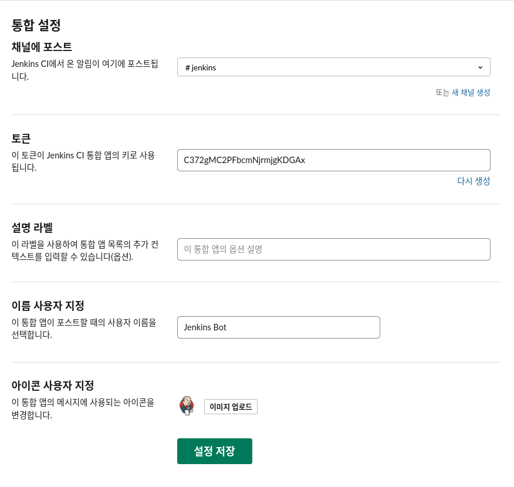
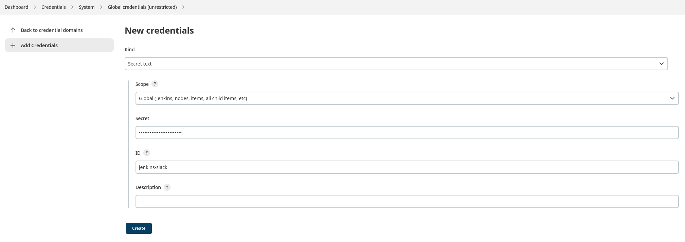

# Jeknins Pipeline을 활용한 GitOps

- [Jeknins Pipeline을 활용한 GitOps](#jeknins-pipeline을-활용한-gitops)
  - [사전 준비](#사전-준비)
    - [Pipeline](#pipeline)
    - [GitHub](#github)
    - [Credential](#credential)
    - [Slack Notification](#slack-notification)
  - [Item 생성](#item-생성)
    - [Declarative Pipeline](#declarative-pipeline)
    - [Scripted Pipeline](#scripted-pipeline)

## 사전 준비

### Pipeline

Manage Jenkins > Manage Plugin에서
'[Pipeline](https://plugins.jenkins.io/workflow-aggregator/)'을 설치한다.
`jenkins-plugin-cli` 를 활용할 수도 있다.
가시성을 위해서 '[Pipeline: Stage View](https://plugins.jenkins.io/pipeline-stage-view/)'도 설치한다.

```sh
docker exec -it jenkins bash
jenkins-plugin-cli --plugins workflow-aggregator:590.v6a_d052e5a_a_b_5
```

### GitHub

Manage Jenkins > Manage Plugin에서
'[GitHub](https://plugins.jenkins.io/github/)'을 설치한다.

### Credential

- [Using credentials](https://www.jenkins.io/doc/book/using/using-credentials/)

Manage Jenkins > Manage Credentials에서 Jenkins store를 선택한다.
Global Credentials (unrestricted)에서 Add Credentials를 선택한다.

- [GitHub - Personal Access Token](https://github.com/settings/tokens/new): repo 권한 추가
  - Username: GiHub Username
  - Password: Token
- SSH Username with private key
  - Username: 원하는 SSH Username
  - Private Key: SSH Private Key. 생성 방법은 [여기](https://help.github.com/en/articles/generating-a-new-ssh-key-and-adding-it-to-the-ssh-agent) 참조
  - Passphrase: SSH Private Key Passphrase
  - Bitbucket, GitLab도 방법 같음.

### Slack Notification

먼저 Slack에서 [Jenkins CI 앱](https://slack.com/apps/A0F7VRFKN-jenkins-ci)을 추가해서 설정한다.



[Slack Notification](https://plugins.jenkins.io/slack/) 설치한 후 Credential을 추가한다.
Slack에서 얻은 토큰을 Secret Text로 추가한다.



Bamboo처럼 Instant Messaging 서버 등을 설정할 필요 없다.

## Item 생성

- New Item > Pipeline
  - [Convert To Pipeline](https://plugins.jenkins.io/convert-to-pipeline/) 플러그인이 모든 것을 변환해주지는 않는다.
- Pipeline script으로 먼저 여러번 테스트한다.
- Pipeline script from SCM
  - 예시 Repository URL: `https://github.com/xpdojo/spring-hello-world.git`
  - Credentials 설정할 경우 SSH 경로

### Declarative Pipeline

- [docs](https://www.jenkins.io/doc/book/pipeline/#declarative-pipeline-fundamentals)

```groovy
pipeline {
  agent any 

  environment {
    NAMESPACE="markruler"
    VERSION="0.1.0"
    PID_PATH="/home/markruler/app.pid"
    TEAM_DOMAIN="my-workspace"
    SLACK_CHANNEL="jenkins"
    CREDENTIAL_ID="jenkins-slack"
  }

  stages {
    stage('Build') { 
      steps {
        sh '''
          echo "Build script"
          echo "Post-build script"
        '''
        // environment 사용 시 sh로 묶을 수 없음
        echo "PATH=${env.PATH}"
      }
    }
    stage('Test') { 
      steps {
        //
      }
    }
    stage('Deploy') { 
      steps {
        script {
          try {
            sh "sudo kill -9 \$(cat ${PID_PATH})"
          }
          catch (exc) {
            echo exc.getMessage()
            echo "catch!"
          }
        }
      }
    }
  }

  post {
    always {
      echo "Finish \'Jenkins\' Pipeline"
    }
    success {
        slackSend (
            color: '#00FF00',
            message: "SUCCESSFUL: Job '${env.JOB_NAME} [${env.BUILD_NUMBER}]' (${env.BUILD_URL})",
            teamDomain: TEAM_DOMAIN,
            channel: SLACK_CHANNEL,
            tokenCredentialId: CREDENTIAL_ID
        )
    }
    failure {
        slackSend (
            color: '#FF0000',
            message: "FAILED: Job '${env.JOB_NAME} [${env.BUILD_NUMBER}]' (${env.BUILD_URL})",
            teamDomain: TEAM_DOMAIN,
            channel: SLACK_CHANNEL,
            tokenCredentialId: CREDENTIAL_ID
        )
    }
  }
}
```

### Scripted Pipeline

- [docs](https://www.jenkins.io/doc/book/pipeline/#scripted-pipeline-fundamentals)

```groovy
def sender = 'noreply@xpdojo.org'
def receiver = 'imcxsu@gmail.com'
TEAM_DOMAIN="my-workspace"
SLACK_CHANNEL="jenkins"
CREDENTIAL_ID="jenkins-slack"

node {
  try {
    stage('Build') { 
      withEnv(['PATH+EXTRA=/usr/sbin:/usr/bin:/sbin:/bin']) {
        echo "My branch is: ${env.NODE_NAME}"
        echo 'env.PATH=' + env.PATH
        if (env.NODE_NAME == 'master') {
          echo 'I only execute on the master branch'
        } else {
          echo 'I execute elsewhere'
        }
        sh 'pwd'
        sh('printenv')
      }
    }
    stage('Test') {
      // 
    }
    stage('Deploy') { 
      //
    }
    stage("Notification") {
      slackSend (
        color: '#00FF00',
        message: "SUCCESSFUL: Job '${env.JOB_NAME} [${env.BUILD_NUMBER}]' (${env.BUILD_URL})",
        teamDomain: TEAM_DOMAIN,
        channel: SLACK_CHANNEL,
        tokenCredentialId: CREDENTIAL_ID
      )
    }
  }
  catch (err) {
    currentBuild.result = "FAILURE"

    slackSend (
      color: '#FF0000',
      message: "FAILED: Job '${env.JOB_NAME} [${env.BUILD_NUMBER}]' (${env.BUILD_URL})",
      teamDomain: TEAM_DOMAIN,
      channel: SLACK_CHANNEL,
      tokenCredentialId: CREDENTIAL_ID
    )

    mail body: "project build error is here: ${env.BUILD_URL}\n error: ${err}" ,
    from: "${sender}",
    to: "${receiver}"
    subject: 'project build failed',

    throw err
  }
}
```
